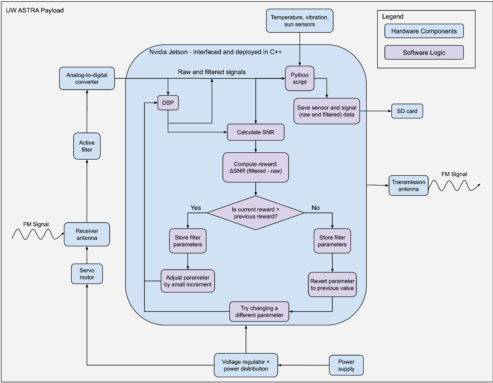

# ASTRA-GeneralRepo

This is a collection of software written for UW ASTRA, a project under the University of Waterloo Space Research team, for its signal analysis stratospheric balloon payload. This project repository contains code for the Reinforcement Learning agent, as well as general purpose scripts, created as part of the CANSBX7 submission on behalf of UW ASTRA.

- **/Data**
  - This folder contains the data that the Reinforcement Learning Agent will be working with, whether it be simulated, or collected manually.
- **/RL-EnvConfig**
  - This folder contains a repository, for an OpenAI Gym Reinforcement Learning Agent, made for the purpose of creating and testing a custom environment.
- **/Scripts**
  - This folder contains general purpose scripts, performing tasks like: signal simulation & data generation, Software Defined Radio (SDR) operations, and some intermediate scripts for debugging and testing purposes .

#### Software Architecture

